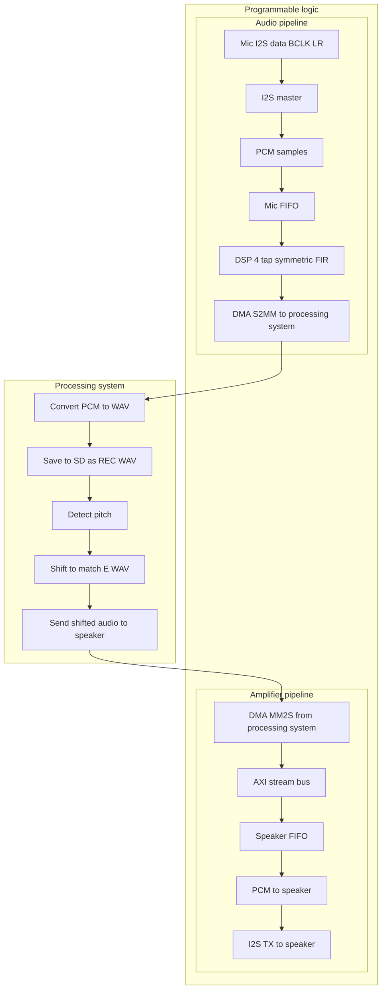

### Real-Time Audio Retuning System with KV260

A COMP3601 embedded systems project implementing a hardware–software audio retuning pipeline on the AMD/Xilinx Kria KV260 platform.

### Overview

This project captures live audio from a MEMS I²S microphone, streams it into DDR via AXI DMA, detects pitch in software, retunes the microphone recording to match a reference WAV file, saves the processed result to the SD card, and plays the shifted audio through an I²S amplifier.

The system performs a full PL ↔ PS round-trip using custom VHDL modules, DMA engines, and a bare-metal C application.

### Key Capabilities

- Real-time audio capture from an I²S MEMS microphone (SPH0645)
- AXI DMA S2MM and MM2S streaming for low-latency audio transfer
- WAV file creation and storage on SD card using FatFs
- Pitch detection using the YIN algorithm
- Pitch shifting using a phase vocoder (time-stretch + resample)
- Real-time playback through a MAX98357A Class-D I²S amplifier
- Automatic generation of `rec_xxx.wav` and `out_xxx.wav`

### Demo Flow (High Level)

1. Place `e.wav` (reference pitch) on the SD card.
2. System records ~7 seconds of audio via I²S RX → FIFO → S2MM DMA.
3. The PS computes the fundamental frequency of:
   - the recorded audio (`rec_xxx.wav`)
   - the reference `e.wav`
4. The PS computes the pitch ratio and applies phase-vocoder pitch shifting.
5. Outputs:
   - `out_xxx.wav` — pitch-shifted WAV file saved to SD card  
   - Real-time playback of shifted PCM streamed back to PL → I²S TX → amplifier → speaker

### System Architecture (Summary)

**PL (Programmable Logic)**  
- I²S Receiver: captures microphone PCM samples  
- Mic FIFO + AXI DMA S2MM: streams samples into PS DDR  
- AXI DMA MM2S: streams processed PCM back to PL  
- Speaker FIFO + I²S Transmitter: outputs PCM to MAX98357A  
- Fully synchronous audio pipeline for both input and output paths

**PS (Processing System – Bare-Metal C)**  
- Reads DMA buffers and converts 24-bit mic PCM to 16-bit WAV PCM  
- Writes `rec_xxx.wav` with valid WAV headers  
- Runs YIN pitch detection on both input and reference audio  
- Computes pitch ratio and applies phase-vocoder pitch shifting  
- Writes `out_xxx.wav` and streams output PCM to PL for playback  
- Uses a 0–7 state machine to control the entire flow

### Software Pipeline Details

**Pitch Detection**  
- Implemented using the YIN algorithm  
- Computes F₀ for both reference and recorded audio  
- Includes threshold-based certainty and fallback behaviours  

**Pitch Shifting**  
- Computes `ratio = F0_reference / F0_recorded`  
- Uses phase-vocoder time-stretching + resampling  
- Preserves duration and timbre while shifting pitch  
- Produces 16-bit PCM suitable for WAV and real-time playback

### Directory Structure

**audio_tuner_software/**  
- Contains all PS source code:
  - `helloworld.c` (main state machine)
  - `Yin.c / Yin.h` (pitch detection)
  - `phase_voc.c / phase_voc.h` (pitch shifting)
  - `wav_pitch_detection.c`
  - `platform.c / platform.h`
  - `lscript.ld`

**Hardware/**  
- Vivado project (`Lab3.xpr`)
- Block design
- I²S RX/TX, FIFOs, DMA configuration
- Exported `Audio_hardware.xsa`

**supporting_resources/**  
- Datasheets (SPH0645 mic, MAX98357A amp, I²S protocol)

**Testing/**  
- UART logs, verification utilities, debug tools

### Build / Run (Quick Notes)

- Open `Hardware/Lab3.xpr` in Vivado to inspect or regenerate the bitstream.  
- Export hardware to Vitis as `Audio_hardware.xsa` if modified.  
- Build the PS application inside `audio_tuner_software/` using Vitis/SDK.  
- Ensure `e.wav` is present on the SD card.  
- Boot the board with the bitstream + ELF.  
- Use SW1 to advance through each state (record → analyse → shift → playback).

### Hardware Used

- SPH0645 I²S MEMS microphone  
- MAX98357A I²S Class-D amplifier  
- AMD/Xilinx Kria KV260 Vision AI starter kit

### Features

- Real-time capture and playback  
- Full PL ↔ PS audio loop using DMA  
- High-quality pitch shifting  
- Correct WAV file generation  
- Modular VHDL design (FIFOs, I²S RX/TX, DMA bridges)  
- Clean state-machine-driven software

### Contributors

- Sadat Kabir — SD card I/O, WAV handling, I²S TX pipeline  
- Ben Huntsman — Output cleanup, SD card flow, integration  
- Dylan Loh — Testing, debugging, I²S TX assistance  
- Bryan Bong — YIN pitch detection and phase-vocoder implementation

### License

Educational use only — for COMP3601 coursework.

### Contact / Next Steps

For development details, testing, or reproduction, open the `Hardware/` and `audio_tuner_software/` directories.

### Software Pre-requisites

1. **Vitis Classic (recommended for COMP3601)**  
   - Install Vitis **2021.1** (the version used for KV260 in this course).  
   - During installation, ensure the **full Vitis package** is installed (SDK, standalone toolchain, platform tools).  
   - Do *not* use Vitis Unified unless explicitly required — the lab content uses Vitis Classic.

2. **Serial Terminal**  
   - Ubuntu: `minicom`  
   - Windows: `PuTTY`

### Building and Running the Software

1. **Open Vitis Classic**  
   - Launch Vitis 2021.1 and create a new workspace.

2. **Create the Platform Project**  
   - Go to **File → New → Platform Project**.  
   - Name the platform project: **Audio_hardware**.  
   - For the hardware specification, browse to the exported XSA file:  
     - `Hardware/Audio_hardware.xsa`  
   - Select **Standalone** (bare-metal) as the domain.  
   - Finish the wizard — Vitis will generate BSP files automatically.

3. **Import the Application Source Code**
   - Go to **File → New → Application Project**.  
   - Name the application project: **audio_tuner_software**.  
   - Select the **Audio_hardware** platform you created earlier.  
   - When prompted for example templates, choose **Empty Application**.  
   - After the project is created, copy/import all source files from:  
     - `audio_tuner_software/src/`  
   - Make sure the following files are included:  
     - `helloworld.c` (main application)  
     - `Yin.c / Yin.h`  
     - `phase_voc.c / phase_voc.h`  
     - `wav_pitch_detection.c`  
     - `platform.c / platform.h`  
     - `lscript.ld` (linker script)

4. **Build the Projects**
   - Right-click **Audio_hardware** → *Build Project*.  
   - Right-click **audio_tuner_software** → *Build Project*.  
   - Ensure there are no errors — Vitis should generate the ELF binary.

5. **Run on Hardware**
   - Power on the KV260 with the SD card inserted (containing `e.wav`).  
   - Program the FPGA with the bitstream (from Vitis or via boot).  
   - Run the generated `audio_tuner_software.elf` on the Cortex-A53.  
   - Use **SW1** on the PMOD board to step through the state machine:  
     1. Idle  
     2. Start recording  
     3. Finish recording  
     4. Pitch detect  
     5. Pitch shift  
     6. Prepare output  
     7. Playback  
     8. Reset / Idle  

6. **Output Files**
   - `rec_xxx.wav` → raw microphone recording  
   - `out_xxx.wav` → pitch-shifted output  
   - Both are saved to the SD card automatically.

