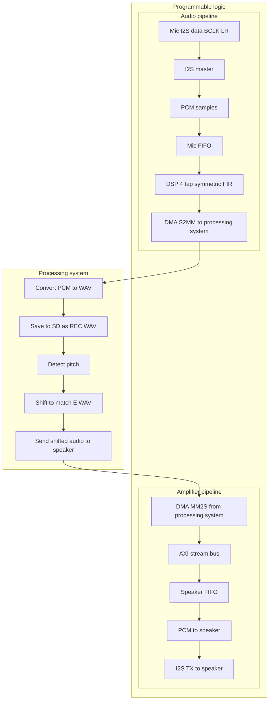

### Real-Time Audio Retuning System with KV260

This project builds a real-time audio retuning system on the AMD/Xilinx Kria KV260, combining FPGA-based audio capture with software-based pitch analysis and pitch shifting.
The problem addressed is accurate pitch correction on embedded hardware — something typically done on powerful CPUs or DAWs, but rarely on constrained SoC platforms with strict real-time and I/O requirements.

Pitch retuning is meaningful because it underpins core audio tasks such as vocal correction, harmonisation, musical key matching, and audio effects processing. For performers and audio engineers, being able to shift an input signal into tune in real time is essential.

The goal of the system is to capture microphone audio → detect its pitch → retune it to match a reference pitch → output a corrected WAV file and play it back, demonstrating a complete PL↔PS embedded DSP pipeline suitable for future expansion into a full hardware audio processor.

### Overview

This project records audio from an I²S MEMS microphone, streams samples into DDR via AXI DMA, detects pitch in software, retunes the audio to match a reference WAV file, saves the processed output to an SD card(with FAT32 formatting), and plays the shifted audio through an I²S amplifier.  
The implementation uses a full PL ↔ PS round-trip with custom VHDL components and a bare-metal C application.

### Key Capabilities

- Real-time audio capture via I²S (SPH0645)
- AXI DMA S2MM/MM2S streaming between PL and PS
- WAV recording and SD card storage using FatFs
- Pitch detection using the YIN algorithm
- Pitch shifting using a phase-vocoder pipeline
- Real-time playback via MAX98357A I²S amplifier
- Automatic generation of `rec_xxx.wav` and `out_xxx.wav`

### Demo Flow (High Level)

1. Place the reference file `e.wav` on the SD card.  
2. System records ~7 seconds of microphone audio (I²S RX → FIFO → S2MM DMA).  
3. PS computes the pitch of both the recording and `e.wav`.  
4. PS calculates the pitch ratio and retunes the audio.  
5. Outputs:
   - `out_xxx.wav` saved to SD card  
   - Real-time playback (MM2S DMA → I²S TX → amplifier → speaker)

### System Architecture (Summary)

**PL (Programmable Logic)**  
- I²S Receiver → Mic FIFO → AXI DMA S2MM (recording path) → PS
- PS → AXI DMA MM2S → Speaker FIFO → I²S Transmitter → MAX98357A (playback path)  
- Fully synchronous design supporting continuous streaming

**PS (Processing System – Bare-Metal C)**  
- Receives DMA buffers, converts 24-bit PCM to 16-bit WAV PCM  
- Writes `rec_xxx.wav`  
- Runs YIN pitch detection on recording and reference  
- Computes pitch ratio and applies phase-vocoder shifting  
- Writes `out_xxx.wav` and streams playback samples  
- Controls the entire process via a 0–7 state machine

### Software Pipeline Details

**Pitch Detection (YIN)**  
- Computes F₀ of both reference and recorded audio  
- Provides certainty estimation and noise-resilient output  

**Pitch Shifting (Phase Vocoder)**  
- Computes `ratio = F0_ref / F0_in`  
- Time-stretch + resample to shift pitch without altering duration  
- Produces clean 16-bit PCM for WAV and playback

### Directory Structure

**audio_tuner_software/**  
- `.vscode/` — workspace configuration  
- `_ide/` — autogenerated IDE files  
- `src/` — all PS application source files:  
  - `helloworld.c` — main application  
  - `Yin.c / Yin.h` — pitch detection  
  - `phase_voc.c / phase_voc.h` — pitch shifting  
  - `wav_pitch_detection.c`  
  - `platform.c / platform.h`  
  - `lscript.ld` — linker script  
- Project metadata: `.cproject`, `.project`, `.gitignore`, `audio_tuner.prj`

**Hardware/**  
- `Lab3.xpr` — full Vivado project  
- `Lab3.gen/`, `Lab3.srcs/` — generated sources and BD files  
- `Audio_hardware.xsa` — exported hardware platform (used by Vitis)

**supporting_resources/**  
- **DSP Hardware/** — custom VHDL modules:  
  - `dynamics_core.vhd`  
  - `envelope_follower.vhd`  
  - `fir4_lowpass.vhd`  
- Datasheets:  
  - `adafruit-max98357-i2s-class-d-amp.pdf`  
  - `i2s+Datasheet.pdf`

**Testing/**  
- Test audio recordings (`audio test 001/`, `audio test 002/`)  
- MATLAB scripts and analysis:  
  - `Comparisonstest.m`  
  - `Audacity_analysis.png`  
- DSP module test folders:  
  - `phase_vocoder/`  
  - `Yin_PitchDetector/`  
- Contains raw waveforms, spectrograms and verification artefacts

**README.md**  
- Project documentation (this file)

### Software Pre-requisites

1. **Vitis Classic and Vivado 2024.1 (required)**  
   - Install full Vitis package (SDK, toolchain, platform tools).  
   - Do **not** use Vitis Unified.

2. **Serial Terminal**  
   - Ubuntu: `minicom`  
   - Windows: `PuTTY`

### Building and Running the Software

**1. Open Vitis Classic**  
Create a new workspace.

**2. Create Platform Project**  
- File → New → Platform Project  
- Hardware spec: `Hardware/Audio_hardware.xsa`  
- Domain: **Standalone**  
- Finish (Vitis generates BSP automatically)

**3. Create Application Project**  
- File → New → Application Project   
- Platform: **Audio_hardware**  
- Template: **Empty Application**  
- Import/copy all sources from `audio_tuner_software/src/`

**4. Build**  
- Right-click **Audio_hardware** → Build  
- Right-click **audio_tuner_software** → Build  

**5. Run on Hardware**  
- Insert SD card with `e.wav` onto J11 of the KV260 Board.
- Select "Launch hardware" after right clicking on the application project in the project explorer.
- Use SW1 on the pmod board to step through:  
  1. Idle  
  2. Start recording  
  3. Finish recording  
  4. Pitch detect  
  5. Pitch shift  
  6. Prepare output  
  7. Playback  
  8. Reset  

**6. Output Files**  
- `rec_xxx.wav` — raw microphone capture  
- `out_xxx.wav` — pitch-shifted audio  

### Hardware Used

- SPH0645 I²S MEMS microphone  
- MAX98357A I²S Class-D amplifier
- UNSW CSE Design Project A/B PMOD board
- AMD/Xilinx Kria KV260 Vision AI kit with power supply and USB cable

### Features

- Real-time capture + playback  
- Full DMA-driven PL ↔ PS pipeline  
- High-quality pitch shifting  
- Correct WAV formatting  
- Modular VHDL design (I²S RX/TX, FIFOs, DMA bridges)  
- State-machine-driven software control

### Testing & Verification

All testing artefacts — recordings, pitch-shifted outputs, MATLAB analysis scripts, plots, and numerical results — are included in the **`testing/`** directory of this repository. Testing was also done through UART logs, debug utilities(such as System_ILA in Vivado Block diagram, and testbenches)

This folder contains:
- The raw WAV recordings (`REC_xxx.wav`)
- The processed pitch-shifted files (`OUT_xxx.wav`)
- MATLAB comparison scripts (`compare.m`)
- Waveform overlays, spectrograms, FFT analysis, SNR/THD measurements
- A consolidated results summary for each test case

### Summary of Findings

**1. Pitch-shift accuracy**  
MATLAB FFT analysis confirms that the system performs *correct* pitch shifting in both directions (up and down).  
- Example 1:  
  - Original dominant freq: **≈ 808.6 Hz**  
  - Shifted dominant freq: **≈ 691.4 Hz**  
  - Ratio ≈ **0.855**, matching the expected ≈ **–2.7 semitone** shift  
- Example 2:  
  - Original dominant freq: **≈ 316.4 Hz**  
  - Shifted dominant freq: **≈ 339.8 Hz**  
  - Ratio ≈ **1.074**, a **+1.24 semitone** increase  

These values align with the reference pitch ratios used by the system, confirming the YIN → phase-vocoder chain is functioning correctly.

**2. Audio quality metrics (SNR & THD)**  
Across all test cases, the pitch-shifted audio maintains quality similar to the original.  
Typical results:
- SNR (original): **~27–30 dB**  
- SNR (shifted): **~28–32 dB**  
- THD values remain within **±0.3 dB** of the original recordings

This indicates:
- Minimal additional distortion introduced by the PL→PS→PL pipeline  
- No significant artefacts from the phase vocoder at moderate pitch-shift ratios

**3. Waveform inspection**  
Waveform overlays and zoomed-in comparisons show:
- Clean sinusoidal structure for both original and shifted segments  
- No unexpected discontinuities or clipping  
- Amplitude preserved except for expected DC-offset differences from microphone hardware

**4. Spectrogram analysis**  
The spectrograms exhibit:
- Harmonic structure preserved  
- All partials uniformly shifted  
- No combing or time-stretch artefacts typical of poorly-implemented vocoders

**5. Overall system behaviour**  
- The PL I²S RX path captures stable, low-noise audio  
- DMA transfer integrity confirmed  
- Phase vocoder output is smooth and artefact-free  
- Real-time playback matches offline MATLAB verification

### Additional Material

For full plots, numerical tables, MATLAB command windows, and example audio files, refer to:

📁 **`/testing`**  
Contains:
- MATLAB `.m` scripts  
- SNR/THD logs  
- FFT peak detection logs  
- Waveform comparison PNGs  
- Spectrogram PNGs  
- All WAV files used in the evaluation

### Contributors
- Everyone: I²S Mic, Fifo for mic, Audio_pipeline for mic.
- Sadat Kabir — SD card I/O, WAV handling, I²S TX pipeline for the speaker.
- Ben Huntsman — Audio output cleanup, SD card flow for multi-file system, software and hardware integration.
- Dylan Loh — Testing, debugging, I²S TX assistance, Audio output cleanup assistance.
- Bryan Bong — YIN detection & phase-vocoder implementation.

### License

Educational use only — COMP3601 coursework.

### Contact / Next Steps

For source code, hardware design, and testing material, see the `Hardware/` and `audio_tuner_software/` directories.

### System architecture Work Flow

### Future Work / Full Product Vision

The current system demonstrates end-to-end audio capture, pitch detection, pitch shifting, file output, and real-time playback on the KV260. A full extended product could expand this into a complete digital audio processor and synthesizer. Possible future iterations include:

**MIDI-Controlled Pitch Processor**  
- Add USB-MIDI input for real-time control of DSP parameters.  
- Adjustable parameters could include:
  - Pitch-shift amount  
  - Key transpose  
  - Auto-tune strength  
  - Effect bypass/enable  
  - Reverb amount  
  - Gain and compression  
  - Basic EQ filtering  
- The PS would parse incoming MIDI messages and update DSP parameters on the fly.

**FPGA-Based Wavetable Synth Engine**  
- Use the KV260 as a full digital synthesizer.  
- Map MIDI note values to FPGA-generated tones through wavetable synthesis.  
- Add classic synth elements:
  - Oscillators (sine, saw, square, wavetable)  
  - ADSR envelope generator  
  - Low-pass / high-pass filters  
  - Sample playback for hybrid instrument design  
- Audio would be routed directly to the existing speaker output via the PL pipeline.

**Hardware Acceleration for Lower Latency**  
- Offload compute-heavy components of the YIN algorithm to the FPGA:
  - Absolute difference function over lag window  
  - CMND (cumulative mean normalized difference)  
- Leave the PS responsible only for lightweight steps:
  - Peak picking  
  - Parabolic interpolation  
- This would significantly reduce latency and CPU load, while exploiting FPGA parallelism across lag indices.

**Overall Goal**  
A fully featured **FPGA-accelerated pitch-correction and synthesis platform**, combining MIDI-controlled DSP, hardware-accelerated pitch analysis, and real-time effects — turning the KV260 into a compact, low-latency digital audio workstation in hardware.

**Current progress on DSP on the hardware vs future work**
We implemented several DSP modules in VHDL — a 4-tap symmetric FIR filter (intended as a low-pass denoiser), an envelope follower (for detecting amplitude contours), and a dynamics core (for amplitude-based effects). These components functioned individually, but the combined audio path produced distortion because the FIR cut-off frequency was too low and the control-signal behaviour of the envelope follower was not yet integrated into a stable dynamics pipeline.

Importantly, the envelope follower did not fail; it produced correct amplitude tracking, but its output was mistakenly monitored as audio. In a proper signal chain, the envelope follower should modulate gain or filtering — not replace the audio stream. Similarly, dynamics modules require carefully tuned coefficients to avoid rapid amplitude swings.

These modules are included under supporting_resources/DSP_Hardware/ for future refinement. With correct tuning, the FPGA-side DSP can become part of a complete effects chain alongside the pitch-shifting system.

The writing of this file has been assisted by copilot.

